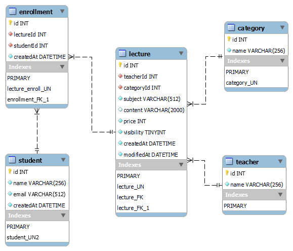

## javascript / node.js LMS 스터디

### 목표
- 간단한 LMS API 만들기

### 사용

- Node.js v.14.18 / Express v.4.17
- MySql v.8.0
- nodemon, config : 실행 관리
- Swagger-Ui : API 시각화
- Mocha, chai, supertest : 테스트 도구
- Joi : 유효성 검사
- Awilix : DI 도구 (일부 사용)

### API 문서
- Swagger-UI : [localhost:8080/apiDocs](http://localhost:8080/apiDocs)

## ERD

### 구현 과정

1. DB 설계
2. 기본 구조 잡기 (router / controller / service / model)
3. API 설계와 문서 작성 (swagger)
4. API 기능 구현
6. 전체 테스트 작성

### API 기능

1. 강사 목록 조회
2. 수강생 가입
3. 수강생 조회
6. 강의 등록
7. 강의 정보 수정
8. 강의 공개 상태 수정
9. 수강 신청 기능
10. 강의 상세 조회
11. 강의 목록 검색/조회
12. 수강생 삭제 기능
13. 강의 삭제 기능

## 작업 중 문제 메모

- MySQL 기본 모듈이 MySQL 8 접속에 에러가 발생
    - 해결 : 개발 접속 계정에만 mysql_native_password 허용 (아래 포스트 참고)
    
    [참고 : Node.js에서 MySQL 연동 실패 해결 (MySQL 8)](https://calvinjmkim.tistory.com/53)
    
- MySQL 기본 모듈이 async/await를 지원하지 않음 → mysql2 모듈로 변경
- API 에러 메시지 포맷 핸들링
    - status code 정리 문제
    - Joi, mysql2에서 발생하는 에러 메시지 커스텀이 어려움
- 코드 변경 후 nodemon 재시작시 변경된 코드가 적용되지 않거나 아예 멈추는 문제 발생
    - 공식 깃허브 이슈 참고 : 최신 버전 v.2.0.13이 윈도우 환경에서 여러 문제가 발생하는 것으로 보임 → v.2.0.7로 다운그레이드 후 문제 해결
    
    [참고 : Issues · remy/nodemon](https://github.com/remy/nodemon/issues)
